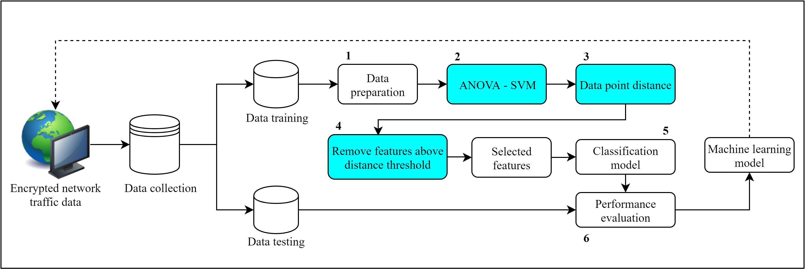
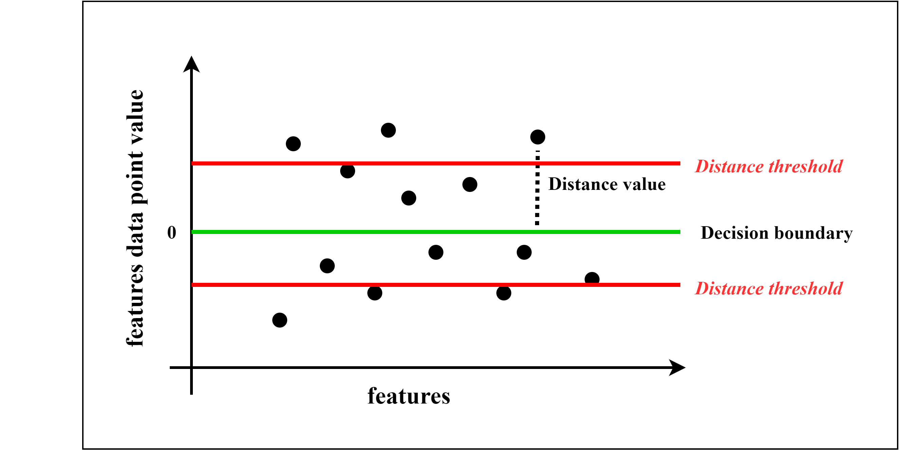

<h1 align="justify">ANOVA-SVM for Selecting Subset Features in Encrypted Internet Traffic Classification </h1>

## Dataset:
1. UNB-CIC VPN Network Traffic Dataset
  - ScenarioA1
  - ScenarioB

<h2 align="center"> ABSTRACT </h2>
<h3 align="justify">Encryption technique is widely used in the internet network for protecting user privacy, maintain the confidentiality of the data, avoid firewall detection, and system administrator.  To prevent encryption techniques in malicious activities such as encrypt the data that contains malware or viruses, illegal transactions like selling drugs, illegal weapons and fake documents, a company and institution using encrypted internet traffic classification to analyze and identify the activity. A challenging problem in encrypted internet traffic classification is the massive number of data in the dataset and many irrelevant features. In this research, we proposed a technique by integrating the ANOVA algorithm with the wrapper method from LinearSVC in the SVM method to overcome this problem. ANOVA algorithm is used to analyze the data's variance and LinearSVC to calculate the relationship between each data to its decision boundary. A new technique is proposed by calculating mean value of the distance value to remove features which relatively far from the decision boundary, this technique is used to isolate features which used for the next process with unused features. The experimental result shows that our proposed method can compete with the existing research method and reduce system detection time</h3>

## Main diagram:

## Proposed method:

## If you use this code, please cite this paper:
[1] A. A. Megantara and T. Ahmad, “ANOVA-SVM for Selecting Subset Features in Encrypted Internet Traffic Classification,” Int. J. Intell. Eng. Syst., vol. 14, no. 2, pp. 536–546, 2021.
